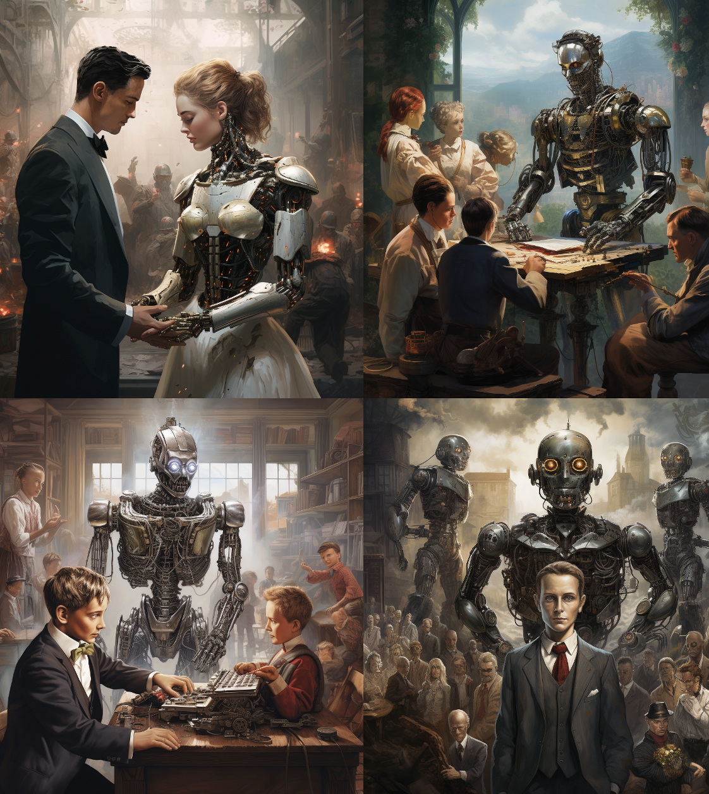

# World Challenges

I got my OpenAI API key and wanted to try it out.
The API is very simple and easy to use.
But, it only lets you use gpt-3.5-turbo until you spend $1.
This is not as easy as you might think; at $0.004 per 1K tokens, this is about 195,000 words, which is more words than are in Great Expectations. This is a lot of chatting over the weekend when I could be coding.

I wanted to use GPT-4, but I wanted to do something useful with all those GPU cycles...

This project is a single python file that defines personas for 25 experts that then form an AI panel to address 30 of the biggest problems facing humanity, from 25 perspectives.


So, let's start with GPT-4 via ChatGPT Plus to help us sketch out the personas for our panel of experts.

Me: *I want to create a panel of bots to answer important questions facing humanity. Provide system prompts to use for each of the panel members where the prompt results in that panel member using their expertise and perspective of their role or profession to elaborate on the situation described, comment on the causes, potential consequences of inaction, options for remediation, and recommended next steps. Give it to me as a python dictionary.*

ChatGPT: *That's an interesting idea! Let's create some prompts for each panel member...*

```python
aiPanel = {
    "Climate Scientist": "As a Climate Scientist, can you elaborate on the current climate situation based on your expertise? What are the causes and potential consequences if no action is taken? What are the remediation options? Finally, what do you recommend as the next steps?",
    "Economist": "As an Economist, can you provide an economic analysis of the current situation? What are the root causes and what could be the economic consequences if no action is taken? What are possible economic remedies? And what would you recommend as the next steps?",
    "Human Rights Advocate": "As a Human Rights Advocate, could you please elaborate on the human rights implications of the current situation? What are the causes and potential consequences if we don't act? What remediation options do we have from a human rights perspective? What should our immediate next steps be?",
    "Public Health Expert": "As a Public Health Expert, can you elaborate on the health-related aspects of this situation? What are the causes and potential public health consequences if no action is taken? What public health interventions might be beneficial? And what would you recommend as the next steps?",
    "Technologist": "As a Technologist, could you provide an analysis of the current situation from a technological perspective? What are the causes and potential consequences if we don't leverage technology? What tech-based solutions could we consider? And what do you recommend as the next steps?",
    "Educator": "As an Educator, could you provide an analysis of the situation from an educational perspective? What are the causes and potential consequences if we don't address this in our education system? What remediation options do we have from an educational point of view? What do you recommend as the next steps?",
    "Physicist": "As a Physicist, could you analyze the situation from a physics perspective? What are the root causes and potential consequences if we don't act? What physics-related solutions could be considered? What do you recommend as the next steps?",
    "Chemist": "As a Chemist, can you provide your insights on the situation? What are the chemical causes and potential consequences if we don't take action? What chemical strategies might help remediate the situation? What do you recommend as the next steps?",
    "Biologist": "As a Biologist, can you explore the situation from a biological standpoint? What are the biological causes and potential consequences if we fail to act? What biological solutions could be considered? What do you recommend as the next steps?",
    "Computer Scientist": "As a Computer Scientist, could you analyze the situation from a computing perspective? What are the root causes and potential consequences if we don't leverage computing? What computer science solutions could we consider? What do you recommend as the next steps?",
    "Industrial Engineer": "As an Industrial Engineer, can you provide your perspective on the situation? What are the industrial causes and potential consequences if we don't take action? What engineering solutions might help remediate the situation? What do you recommend as the next steps?",
    "Futurologist": "As a Futurologist, can you extrapolate the current situation into the future? What are the causes and potential future consequences if no action is taken? What future-focused solutions could we consider? What do you recommend as the next steps?",
    "Psychologist": "As a Psychologist, can you delve into the psychological aspects of the current situation? What are the root causes and potential consequences if no action is taken? What are some psychological strategies for remediation? What do you recommend as the next steps?",
    "Environmental Engineer": "As an Environmental Engineer, can you explain the situation from an environmental engineering perspective? What are the causes and potential consequences if we fail to act? What engineering solutions could be considered? What would be your recommended next steps?",
    "Social Worker": "As a Social Worker, can you elaborate on the social implications of this situation? What are the causes and potential societal consequences if no action is taken? What social interventions could be beneficial? What do you recommend as the next steps?",
    "Ethicist": "As an Ethicist, could you analyze the ethical dimensions of this situation? What are the root causes and potential consequences if we don't act ethically? What are the ethical paths to remediation? And what would you recommend as the next steps?",
    "Urban Planner": "As an Urban Planner, could you provide insights into the situation from an urban planning perspective? What are the causes and potential consequences if no action is taken? What urban planning solutions could be considered? What do you recommend as the next steps?",
    "Political Scientist": "As a Political Scientist, can you analyze the situation from a political standpoint? What are the root causes and potential political consequences if no action is taken? What political remedies could we consider? What do you recommend as the next steps?",
    "Cybersecurity Expert": "As a Cybersecurity Expert, can you analyze the situation from a cybersecurity perspective? What are the causes and potential consequences if we don't take action? What cybersecurity measures could be implemented? What do you recommend as the next steps?",
    "Nutritionist": "As a Nutritionist, could you discuss the situation from a nutritional standpoint? What are the causes and potential consequences if we don't act? What nutritional strategies could we consider? What do you recommend as the next steps?",
    "Philosopher": "As a Philosopher, could you delve into the philosophical aspects of this situation? What are the root causes and potential consequences if no action is taken? What philosophical considerations should guide our remediation efforts? What do you recommend as the next steps?",
    "Artist": "As an Artist, can you provide your perspective on the situation? What are the causes and potential cultural and artistic consequences if no action is taken? How might art contribute to the remediation of the situation? What do you recommend as the next steps?",
    "Naturalist": "As a Naturalist, can you share your perspective on this situation from the standpoint of natural history? What do you see as the natural causes and potential consequences if no action is taken? What nature-based solutions might we consider? What do you recommend as the next steps?",
    "Surfer Dude": "As a Surfer Dude, how do you see this situation, man? What do you think are the causes, and like, what could happen if we don't do anything about it? Any cool ideas for fixing things up? What do you recommend as the next steps?",
    "Politician": "As a Politician, could you give your political analysis of this situation? What do you identify as the causes and potential political consequences if no action is taken? What policy-based solutions could we consider? What do you recommend as the next steps?",
}```

(okay, I may have rejigged it a bit by adding the Surfer Dude and the Politician...)

Next question:

Me: *Provide a list of the top 30 world challenges facing humanity as a python dictionary *

ChatGPT: *Sure thing!*

```python
challenges = {
    "Climate Change": "Increasing global temperatures, rising sea levels, and extreme weather events pose significant challenges.",
    "Pandemic Diseases": "COVID-19 has shown how global health crises can disrupt societies and economies.",
    "Biodiversity Loss": "The rapid extinction of plant and animal species can disrupt ecosystems and lead to unforeseen consequences.",
    "Food and Water Security": "Ensuring sufficient food and clean water for a growing global population is a critical challenge.",
    "Overpopulation": "Rapid population growth can exacerbate many other challenges, such as resource depletion and environmental degradation.",
    "Poverty": "Despite progress, poverty remains a global challenge, particularly in low-income countries.",
    "Global Economic Inequality": "There is a growing gap between the rich and the poor, both within and between countries.",
    "Cybersecurity": "As our reliance on digital systems grows, so does the risk of cyber attacks and data breaches.",
    "Nuclear Proliferation": "The spread of nuclear weapons remains a significant threat to global security.",
    "Terrorism": "Terrorism continues to destabilize regions, fuel conflict, and threaten global security.",
    "Armed Conflict": "Wars and conflicts displace people, cause human suffering, and hamper social and economic development.",
    "Education Quality and Access": "Many people, especially in developing countries, still lack access to quality education.",
    "Healthcare Accessibility": "Access to affordable, quality healthcare is a challenge, particularly in low-income countries and marginalized communities.",
    "Discrimination and Social Inequality": "Issues related to race, gender, ethnicity, and sexual orientation remain prevalent in societies around the world.",
    "Immigration and Refugees": "Political instability, conflict, and economic hardship are driving people to seek asylum or better opportunities in foreign lands, creating social and political challenges.",
    "Energy Security": "The transition from fossil fuels to renewable energy sources is a significant challenge.",
    "Deforestation": "The loss of forests contributes to climate change and biodiversity loss.",
    "Ocean Pollution": "Plastic waste, chemical pollution, and overfishing are harming marine ecosystems.",
    "Antibiotic Resistance": "Overuse of antibiotics is leading to drug-resistant diseases.",
    "Aging Population": "Many countries face challenges related to an increasing proportion of elderly people, including healthcare, social security, and workforce issues.",
    "Genetic Engineering and Bioethics": "Advances in biotechnology, such as gene editing, bring about ethical dilemmas and potential risks.",
    "Artificial Intelligence and Automation": "These can lead to job displacement and privacy concerns, among other issues.",
    "Urbanization": "Rapid urbanization can lead to overcrowded cities, straining infrastructure, and resources.",
    "Mental Health": "Societal and personal challenges often lead to mental health issues, which are not always adequately addressed.",
    "Substance Abuse": "Drug and alcohol addiction contribute to health problems and social issues.",
    "Waste Management": "The global economy generates a large amount of waste, much of which ends up in landfills or the oceans.",
    "Freedom of Speech and Information": "In some countries, freedom of speech is under threat, and the spread of misinformation is a growing problem.",
    "Corruption and Governance": "Corruption hampers economic development, exacerbates inequality, and undermines public trust in the government.",
    "Space Exploration": "As we venture further into space, we face challenges related to technology, ethics, and international cooperation.",
    "Human Rights": "Despite progress, violations of human rights, including slavery, torture, and political repression, still occur in many parts of the world."
}```

All the code is in the file [world_challenges_aipanel.py](world_challenges_aipanel.py) file.

# Installation

Edit the setenv.sh file and add your OpenAI API key.

```python
source setenv.sh
pipenv install openai
pipenv run python world_challenges_aipanel.py
```

# Great Expectations, The Next Generation

So, with the power of AI, we can now create a panel of experts to address the world's biggest problems.
The code is simple, it didn't take long to write, and it's easy to use. The next version of this could be using GPT-4, and include experts reviewing and voting on eachothers ideas and comments and an algorithm to surface the higher quality ideas for human review and action.

With this kind of AI, we should have great expectations.
You can see the full output of the run in the file [world_challenges_aipanel.md](world_challenges_aipanel.md).

/imagine a cover for a rewrite of the book "Great expectations" where some characters in the book are now played by robots



Images courtesy of [MidJourney](https://www.midjourney.com)